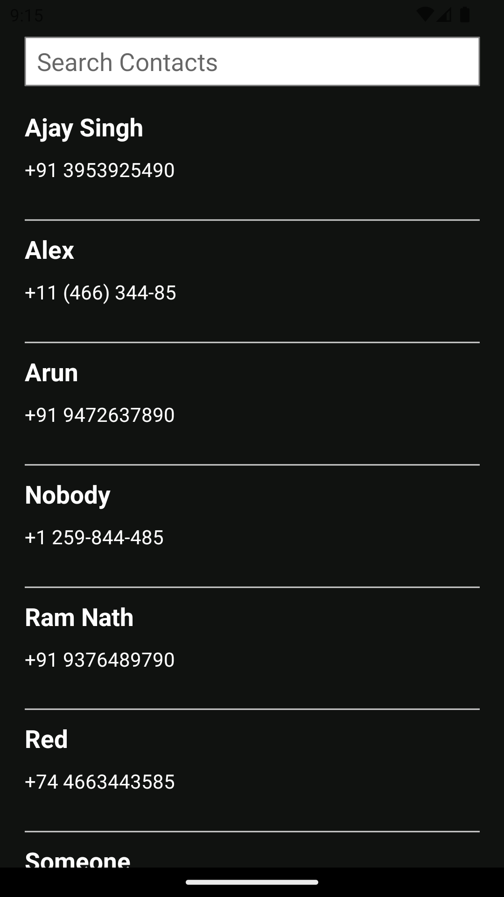
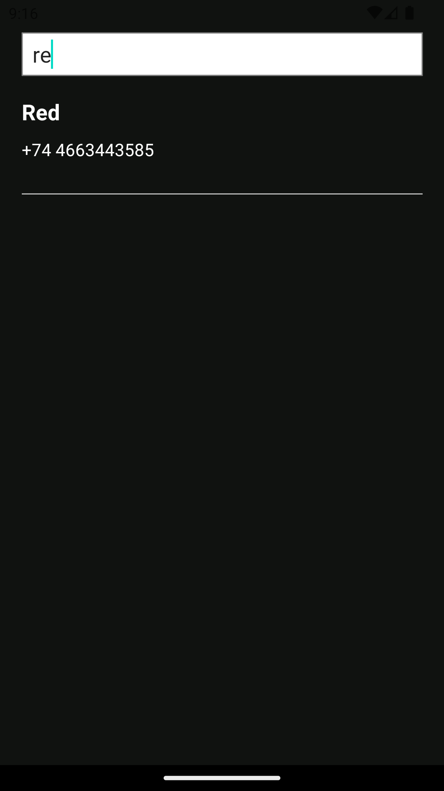
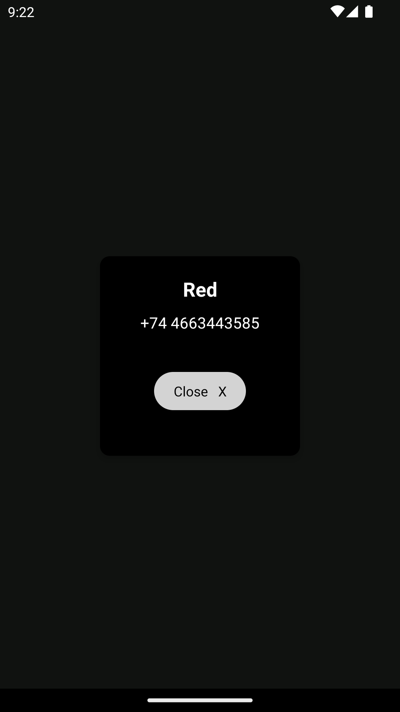

# Contacts App

This is a simple React Native app that allows you to search and display contacts from your device's contact list. The app utilizes the Expo Contacts API to fetch and display the contacts.

To install expo-contacts: `npx expo install expo-contacts`

## Components

The app consists of the following components:

- `App`: The main component that renders the entire application. It handles the state for search text, contacts, and selected contact. It also contains the logic for fetching contacts and filtering them based on search text. The `App` component renders a `TextInput` for searching, a `FlatList` to display the contacts, and a `Modal` to show the details of a selected contact.

## Libraries and Plugins Used

The app uses the following libraries and plugins:

- `react-native`: The main library for building native mobile applications using JavaScript.
- `react`: The library for building user interfaces in JavaScript.
- `expo-contacts`: The Expo Contacts API that provides access to the device's contact list.
- `react-native-modal`: A library for showing modals in React Native applications.

Please ensure that you have these libraries installed before running the app.

## Usage

To use the app, follow these steps:

1. Install the required libraries by running `npm install` or `yarn install` in the project directory.
2. Start the app by running `npx expo start` in the project directory.
3. Open the Expo client on your mobile device or use an emulator to view and interact with the app.

## Contact Filtering and Selection

- To search for contacts, enter text in the search input field. The contacts will be filtered based on the entered text, and the filtered contacts will be displayed in the `FlatList`.
- Tap on a contact item in the list to select it. This will open a modal displaying the selected contact's details, including the full name and phone number.
- To close the modal, tap the "Close X" button.

<table>
  <tr>
    <td>
      
    </td>
    <td>
      
    </td>
    <td>
      
    </td>
  </tr>
</table>
